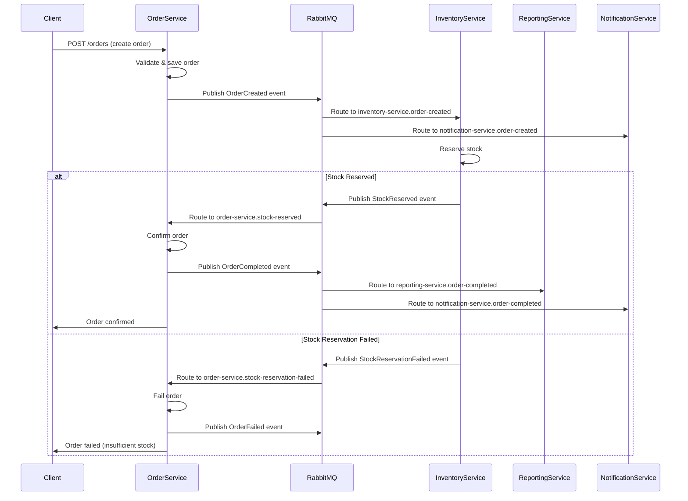
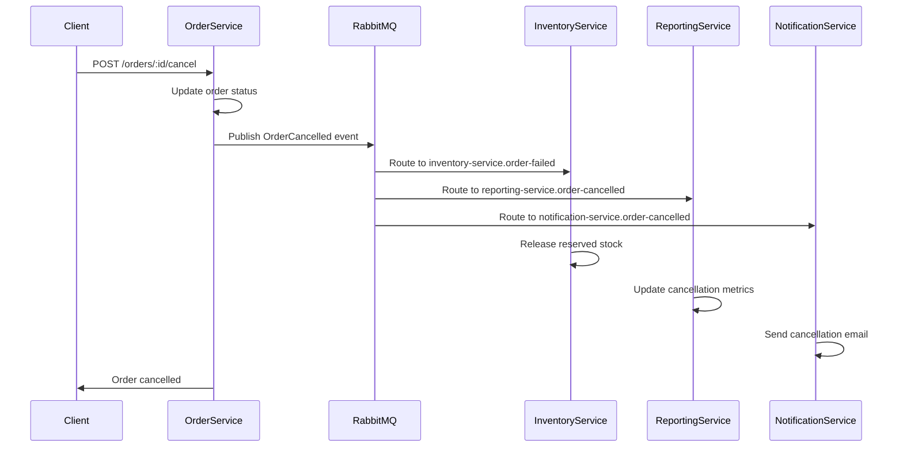
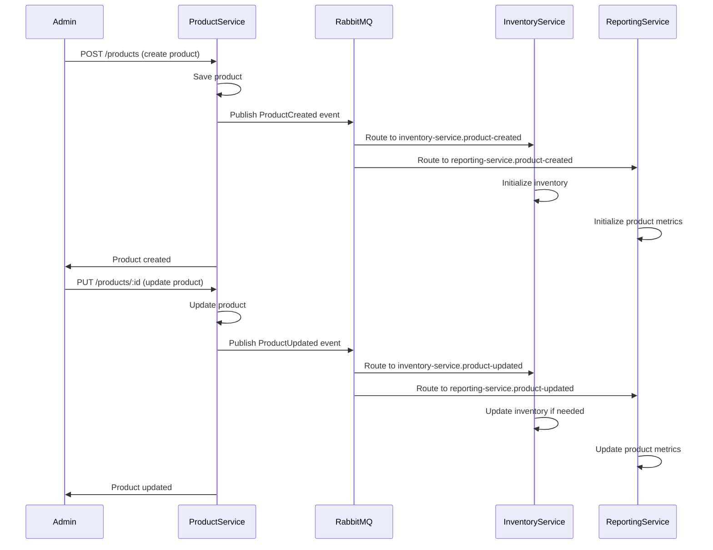
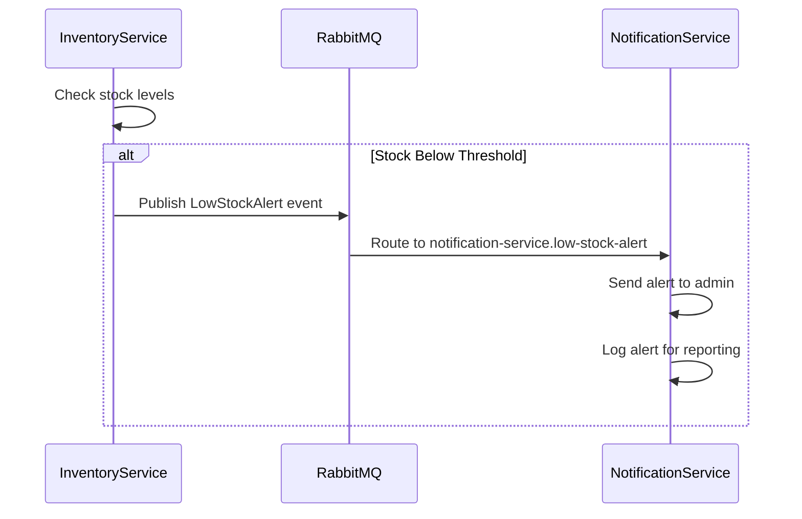
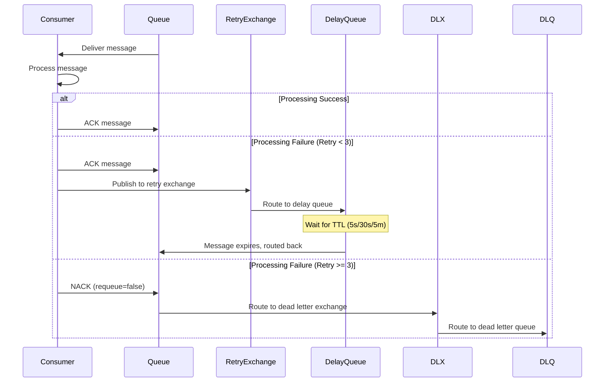
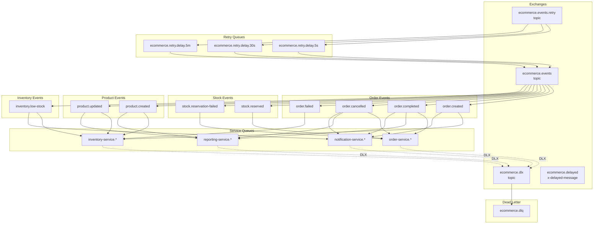

# Event Flow Documentation

## Order Processing Flow

## Order Cancellation Flow

## Product Management Flow

## Low Stock Alert Flow

## Retry and Dead Letter Flow

## Event Routing Diagram

## Service Communication Matrix

| Event | Publisher | Subscribers |
|-------|-----------|-------------|
| OrderCreated | order-service | inventory-service, notification-service |
| OrderCompleted | order-service | reporting-service, notification-service |
| OrderCancelled | order-service | reporting-service, notification-service, inventory-service |
| OrderFailed | order-service, inventory-service | inventory-service |
| StockReserved | inventory-service | order-service |
| StockReservationFailed | inventory-service | order-service |
| ProductCreated | product-service | inventory-service, reporting-service |
| ProductUpdated | product-service | inventory-service, reporting-service |
| LowStockAlert | inventory-service | notification-service |

## Message Priority Levels

| Priority | Event Types | Description |
|----------|-------------|-------------|
| 10 (Highest) | OrderCreated, StockReserved | Critical order processing |
| 8 | OrderCompleted, OrderCancelled | Order status updates |
| 6 | StockReservationFailed, OrderFailed | Error handling |
| 4 | ProductCreated, ProductUpdated | Product management |
| 2 (Lowest) | LowStockAlert | Notifications and alerts |

## Queue Configuration Summary

| Queue | TTL | Max Priority | DLX | Description |
|-------|-----|--------------|-----|-------------|
| inventory-service.* | 24h | 10 | ecommerce.dlx | Inventory operations |
| order-service.* | 24h | 10 | ecommerce.dlx | Order processing |
| reporting-service.* | 24h | 10 | ecommerce.dlx | Reporting and analytics |
| notification-service.* | 24h | 10 | ecommerce.dlx | Notifications |
| ecommerce.dlq | 7d | - | - | Dead letter storage |
| ecommerce.retry.delay.* | - | 10 | ecommerce.events | Retry delays |
